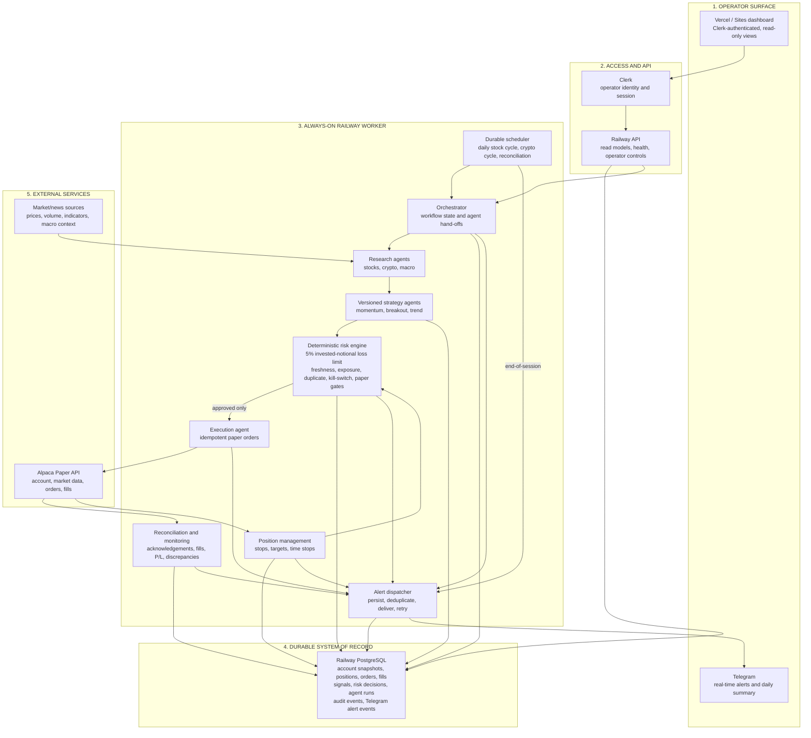

# Momentum Autopilot — Layered Architecture

This is the engineer-facing box-and-layer view of the paper-trading system. The browser is an observer/control surface; Railway keeps the trading workflow running when the browser is closed.



## Decision path

```text
Market data → Research → Strategy signal → Deterministic risk validation
→ Paper order → Alpaca acknowledgement/fill → Reconciliation → Dashboard + Telegram
```

The risk engine is the mandatory boundary. No research agent, strategy agent, dashboard action, or Telegram event can bypass it. PostgreSQL is the durable source of truth; Telegram is a notification channel, not an execution control.

